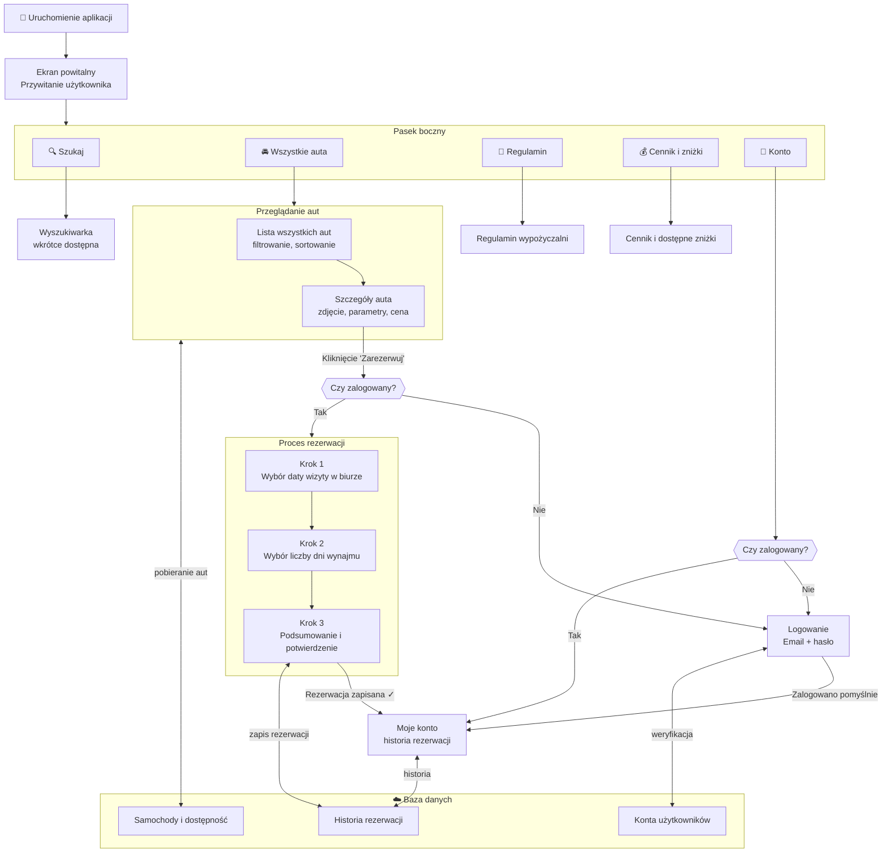

# Jak działa aplikacja

```mermaid
flowchart TD
    start["🚗 Uruchomienie aplikacji"]
    welcome["Ekran powitalny\nPrzywitanie użytkownika"]

    start --> welcome --> nav

    subgraph nav["Pasek boczny"]
        s1["🔍 Szukaj"]
        s2["🚘 Wszystkie auta"]
        s3["📄 Regulamin"]
        s4["💰 Cennik i zniżki"]
        s5["👤 Konto"]
    end

    s1 --> szukaj["Wyszukiwarka\nwkrótce dostępna"]
    s2 --> lista

    subgraph lista["Przeglądanie aut"]
        auta["Lista wszystkich aut\nfiltrowanie, sortowanie"]
        szczegoły["Szczegóły auta\nzdjęcie, parametry, cena"]
        auta --> szczegoły
    end

    s3 --> regulamin["Regulamin wypożyczalni"]
    s4 --> cennik["Cennik i dostępne zniżki"]

    s5 --> czy_zalogowany{{"Czy zalogowany?"}}
    czy_zalogowany -->|"Nie"| logowanie["Logowanie\nEmail + hasło"]
    czy_zalogowany -->|"Tak"| konto["Moje konto\nhistoria rezerwacji"]

    logowanie -->|"Zalogowano pomyślnie"| konto

    szczegoły -->|"Kliknięcie 'Zarezerwuj'"| czy_auth{{"Czy zalogowany?"}}
    czy_auth -->|"Nie"| logowanie
    czy_auth -->|"Tak"| rezerwacja

    subgraph rezerwacja["Proces rezerwacji"]
        r1["Krok 1\nWybór daty wizyty w biurze"]
        r2["Krok 2\nWybór liczby dni wynajmu"]
        r3["Krok 3\nPodsumowanie i potwierdzenie"]
        r1 --> r2 --> r3
    end

    r3 -->|"Rezerwacja zapisana ✓"| konto

    subgraph baza["☁️ Baza danych"]
        b1["Konta użytkowników"]
        b2["Samochody i dostępność"]
        b3["Historia rezerwacji"]
    end

    logowanie <-->|"weryfikacja"| b1
    lista <-->|"pobieranie aut"| b2
    r3 <-->|"zapis rezerwacji"| b3
    konto <-->|"historia"| b3
```